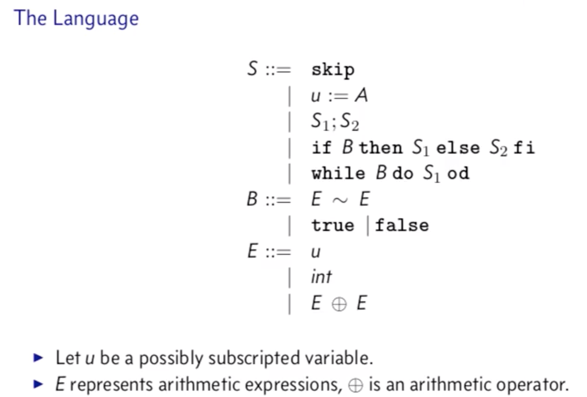

# 4.1.1 Semantics
* Define **judgment**, which is something that asserts a property about a piece of code or syntactic object
* **proof rules**, recursive inductive objects which define when judgments are valid
* **proof trees**, which look like proof rules stacked together to prove something about more complex syntactic object

## Judgments
A judgment is an assertion about a syntactic object. Example: 3 is odd. Asserting the object 3 is odd is a judgment.

A **rule** tells us when a judgment is true and when it is not true. We can define judgments inductively from sets of judgments called **assumptions** or **premises**. If a judgment has no assumptions or premises, it is an **axiom**. To see, visually, how this works, see the 4.1.1 video.

A **side condition** is a premise that is not a judgment. It is written off to the right side of a rule. 

## Building Proof Trees
When you build a rule, sometimes the conclusion is complicated enough that the premises need to be proved. This makes a recursive structure and forms a proof tree. In real life, you typically start with your conclusion and work backwards to figure out what you need to prove. 

# 4.1.2 Big Step Semantics
Big Step Semantics tells you the result of evaluating an expression in a particular programming language. It's a mathematical notation that corresponds to `eval`, which we wrote.

* Describe the components of a **big step semantic rule**
* Use semantic rules to document the meaning of a simple programming language
* Explain the correspondence between big step semantics and the `eval` function

Let us consider the **Simple Imperative Programming Language**;

`u:=a` is an assignment, we have a way to do nothing (`skip`), we have a semicolon which lets us combine two statements into one. It is a **separator**, not a **terminator** like most languages(??). We have conditions and repetitions as well. There are two kinds of expressions: `B` and `E`, boolean and integer expressions respectively. 

We have three kinds of judgments (`V` is down arrow). 

* Statements: `<S, sigma> V sigma prime` -- A statement combined with an environment (`sigma`) returns a modified environment (`sigma prime`).
* Expressions: `<E, sigma> V_e v` -- An expression evaluated in an environment returns a value. But what is the subscript `e`? It would be too kind of our esteemed professor to explain.
* Booleans: `<B, sigma> V_b b`  -- Boolean expressions plus an environment returns a boolean.

To prep for an exam, I should make a toy language and notate all the stuff here from 5:00 on for it. 

# 4.2.1 Lambda Calculus
* Explain the three constructs of Lambda Calculus.
* Given a syntax tree diagram, write down the equivalent Lambda Calculus term.
* Perform a beta-reduction.


There are only three constructs in Lambda Calculus. 
* Variables (usually one letter long, as Lambda Calculus is generally without spaces)
* Function application is done by juxtaposing like in Haskell, except without spaces. `fy` is `f` applied to `y`. We can use parenthesis to change the order of operation.
* Functions themselves. I will use `\` to denote a lambda. `\x.x` could be more colloquially interpreted as `f(x) = {x}`. Functions are also known as abstractions.

Lambda Calculus is used extensively in PL research. Its minimalist nature tends to make proving things easier and shorter, and it provides a basis for functional programming languages like Haskell.

Here are some famous functions:
```
\x.x -- the identity function
\x.xx -- "delta" function, applies a function to itself, useful in the halting problem
```

In syntax trees, an `@` represents function application. A `\` creates a **binding**, and arguments internal to the lambda are bound to that lambda. A **free variable** is a variable that is not bound in its syntax tree. 

# 4.2.2
* Performa a beta-rreduction
* Detect alpha-capture and use alpha-renaming to avoid it.
* Normalize any given lambda-calculus turm.

Examples:
```haskell
(\x.x) a -- the identity function:
     @
  \x   a  -- <beta reduction> -> a  
   x   
```

```haskell
(\x.x x) a -- lambda x, x applied to x
     @
  \x   a -- <beta reduction> -> @
   @                          a   a
 x  x
```

```haskell
(\x.y x) a -- lambda x, y applied to x
     @
  \x   a -- <beta reduction> -> @
   @                          y   a
 y   x
```

```haskell
(\x.\a.x) a -- must change parameter to a' (a prime) to avoid naming conflict:
(\x.\a'.x) a  
    @ 
 \x   a
 \a        -- <beta reduction> -> \a'
  x                                a
```

When you have conflicting variable names, you walk up the tree and bind it to the first thing it sees (most local)

```haskell
(\x.\x.x) a

	   @
	\x   a              -- <beta reduction> ---> \x
        \x --------- x variable is scoped to here     x
         x
```


# 4.2.3
## Evaluation Order
* If there is more than one beta reduction, which one do you do first?
* When is it acceptable to leave a beta reduction unreduced?

### Applicative Order
* **Applicative Order** is like call-by-value. Start with the left-most outer-most application, then evaluate the argument before doing the beta reduction. We prioritize reducing arguments.
* **Normal Order** is like call-by-name, what the C preprocessor uses. Left-most outer-most again, but do the beta reduction immediately. 

Applicative order _usually_ has fewer reductions. If the lambda calculus expression terminates, then normal and applicative orders produce the same result. 

### Weak Head Normal Form
If the root node of a syntax tree is a lambda, then everything inside is the body of the function. This is **weak head normal form**. This form closely resembles what "real programming languages" do. Don't evaluate inside the body of a function until you know all of the values and the function is called.

### Normal Form
In normal form, if the outermost node is a lambda, you keep descending into the body. You do get maximally reduced functions, expressions are smaller, sometimes things are incorrect though via alpha capturing.

# 4.2.4
## Church Numerals
We will implement integers and booleans with lambda calculus, as well as defining:
* inc, plus, times
* and, or, not, if
We can then extend this to represent other types.

A number is an intangible thought, and a numeral is a representation of this intangible number.

```haskell
f0 = \f -> \x -> x
f1 = \f -> \x -> f x
f2 = \f -> \x -> f $ f x
f2 = \f -> \x -> f $ f $ f x
-- ...etc
```
For booleans, we represent them as such:
```haskell
true = \ a b -> a
false = \ a b -> b
```
We just choose an option, given two options. Now, how would a logical `or` work?

```haskell
or = \ ca cb -> x true y
and = \x y -> x y false
cif = \c t e -> c t e
```
Wat. (?)


