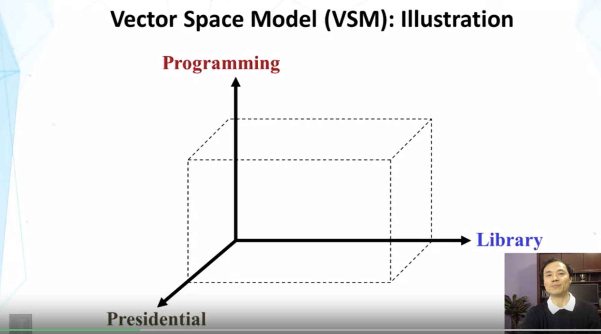
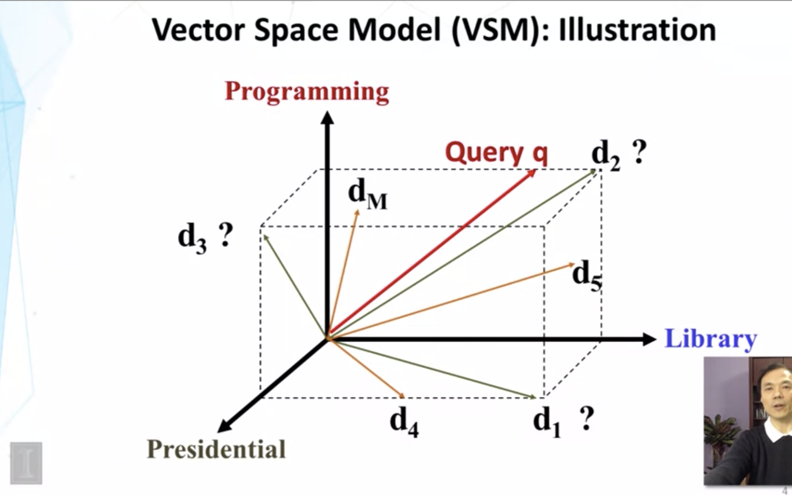

# The Vector Space Model
A vector space model is a special case of similarity based models. Relevance is defined roughly as a function of similarity between the document and query. 
We are going to work with the following definition of relevance, even though other potentially better options exist:
> If `d_1` is more similar to `q` than `d_2`, then `d_1` is _more_ relevant than `d_2`.

Think of constructing a high dimensional space where each dimension corresponds to a term:

Here we have a three dimensional space with three terms. All of our documents, and our query, will be placed in this space as a vector. Let's map some documents and a query to this space:

VSM is a framework in which we make the following assumptions:
* Represent a document and query by a term vector
 * a *term* is a basic concept, word, or phrase.
* Each term defines one dimension
* A query vector consists of a number of elements corresponding to the weights of different terms
* Each document vector indicates the weight of the corresponding term.
